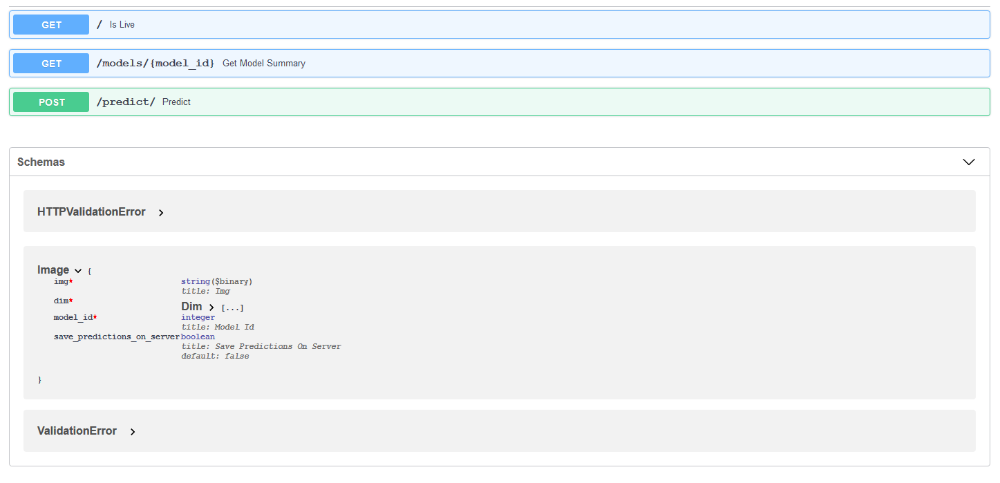

## darknet-fastapi-modelserver

### A simple fastapi model server for darknet (yolov1 to yolov4).


#### Installation

* **Install python >= 3.8.0**

* `sudo apt install cmake`  (v3.10)

* `sudo apt install libopencv-dev python3-opencv` (v3.2)

* `git clone https://github.com/AlexeyAB/darknet.git`

* `cd darknet`

* inside Makefile, `NVCC = /usr/local/cuda/bin/nvcc`

* Find cuda version, `cat /usr/local/cuda/version.txt`

* add to `~/.bashrc`

```
export CPATH=/usr/local/cuda-11.0/targets/x86_64-linux/include:$CPATH
export LD_LIBRARY_PATH=/usr/local/cuda-11.0/targets/x86_64-linux/lib:$LD_LIBRARY_PATH
export PATH=/usr/local/cuda-11.0/bin:$PATH
```

* add `export LD_LIBRARY_PATH=/usr/local/cuda/lib64:$LD_LIBRARY_PATH` to `~/.bashrc`

* reload current settings, `source ~/.bashrc`

* inside darknet Makefile, turn on GPU, CUDA, OPENCV

* inside darknet folder, `sudo make -j12` 

* `cp libdarknet.so /usr/local/libdarknet.so`

* `pip install -r requirements.txt`

#### Configuration

* Keep your `.cfg`, `.data`, `.weights` files inside `model_data` folder. Keep the `.names` files in the /

* Specify the paths of each model component inside `model_config.py`

#### Run

* `uvicorn serve:app --reload --host '0.0.0.0' --port 8000`

* docs at  http://127.0.0.1:8000/docs

#### Test

* Run `python requests_client.py`

#### API



